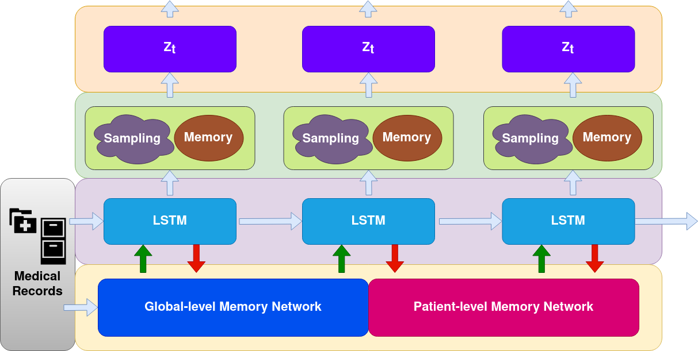

# TC-EMNet

This repository contains implementation code for the paper "Temporal Clustering with External Memory Network for Disease Progression Modeling"

## Model Architecture

 We propose Temporal Clustering with External Memory Network (TC-EMNet) for disease progression modeling via both supervised and unsupervised setting. At each time step, TC-EMNet takes EHR medical record as input and encodes the input feature using a recurrent neural network to get hidden representations. Then TC-EMNet samples from the hidden state to form a latent representation. Meanwhile, the hidden state is stored into a global-level memory network, which in turn outputs a memory representation based on current memory. The memory representation is then concatenated with the current latent representation to form the patient representation at current time step. When training label is available, the model also employs a patient-level memory work to process label information up to previous visits and outputs target-aware memory representation. We combine memory representations from global-level and patient-level memory network using a calibration process. TC-EMNet is trained with reconstruction objective under unsupervised setting and prediction objective under supervised setting.

 ## Environments

Use the following command to install required dependencies:

 `conda env create -f environment.yml`

## Model Training

To run training, use the following command:

`bash train.sh`